# GigFlow Server

The backend API for the GigFlow freelancing marketplace. Built with Node.js, Express, and MongoDB.

## Tech Stack

- **Runtime:** Node.js
- **Framework:** Express.js
- **Database:** MongoDB (with Mongoose)
- **Authentication:** JWT (Cookie-based), bcrypt
- **Real-time:** Socket.io
- **Validation:** Zod / Class Validator
- **Logging:** Winston

## Key Features

- **Authentication:** User registration, login, logout, profile management. Safe handling of user data.
- **Gig Management:** Create, read, update, delete gigs.
- **Bidding System:** Freelancers can place bids; Owners can hire freelancers. Real-time updates via websockets.
- **Notifications:** Real-time notifications for bids, hiring status, and system alerts.
- **Strict Typing:** TypeScript used throughout for type safety.

## Hiring Transaction Flow

The hiring process is a critical atomic transaction ensuring data integrity:

```mermaid
flowchart TD
    Start([Owner Clicks Hire]) --> ValidateBid{Bid Valid?}
    ValidateBid -->|No| Error1[❌ Bid Not Found]
    ValidateBid -->|Yes| CheckOwner{Is Gig Owner?}
    
    CheckOwner -->|No| Error2[❌ Unauthorized]
    CheckOwner -->|Yes| CheckStatus{Bid Status<br/>PENDING?}
    
    CheckStatus -->|No| Error3[❌ Already Processed]
    CheckStatus -->|Yes| CheckGig{Gig Status<br/>OPEN?}
    
    CheckGig -->|No| Error4[❌ Gig Unavailable]
    CheckGig -->|Yes| StartTx[Start MongoDB Transaction]
    
    StartTx --> DoubleCheck{Re-check Gig<br/>Status OPEN?}
    
    DoubleCheck -->|No| RaceError[❌ RACE CONDITION<br/>Another hire in progress]
    DoubleCheck -->|Yes| AtomicOps
    
    subgraph AtomicOps[" Atomic Transaction "]
        direction TB
        Op1[Update Bid → HIRED] --> Op2[Reject Other Bids]
        Op2 --> Op3[Update Gig → ASSIGNED]
    end
    
    AtomicOps --> Commit[Commit Transaction]
    Commit --> NotifyHired[Notify Hired Freelancer]
    NotifyHired --> NotifyRejected[Notify Rejected Freelancers]
    NotifyRejected --> Success([✅ Success])
    
    RaceError --> Abort[Abort Transaction]
    Abort --> UserError[Return Error:<br/>Gig No Longer Available]
    
    style AtomicOps fill:#1a1a1a,stroke:#666,stroke-width:2px
    style Success fill:#0d4,stroke:#333,stroke-width:2px
    style Error1 fill:#d33,stroke:#333,stroke-width:2px
    style Error2 fill:#d33,stroke:#333,stroke-width:2px
    style Error3 fill:#d33,stroke:#333,stroke-width:2px
    style Error4 fill:#d33,stroke:#333,stroke-width:2px
    style RaceError fill:#d33,stroke:#333,stroke-width:2px
    style UserError fill:#d33,stroke:#333,stroke-width:2px
```




## Setup & Installation

1.  **Install Dependencies:**
    ```bash
    pnpm install
    ```

2.  **Environment Variables:**
    Create a `.env` file in the `server` directory based on `.env.example` (if available) or ensuring the following:
    ```env
    PORT=8000
    MONGO_URI=mongodb://localhost:27017/gig-flow
    JWT_SECRET=your_jwt_secret
    JWT_REFRESH_SECRET=your_refresh_secret
    NODE_ENV=development
    CLIENT_URL=http://localhost:3000
    ```

3.  **Run Development Server:**
    ```bash
    pnpm run dev
    ```


## API Documentation

- **Swagger UI:** Available at `http://localhost:8000/v1/swagger` when running locally.
- **Base URL:** `http://localhost:8000/api/v1/development`

## Project Structure

- `src/modules`: Feature-based architecture (Auth, User, Gig, Bid, Notification).
- `src/models`: Mongoose schemas.
- `src/middlewares`: Auth checks, error handling, validation.
- `src/lib`: Core utilities (logger, socket, api).
